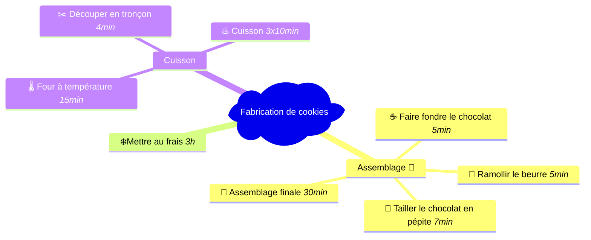
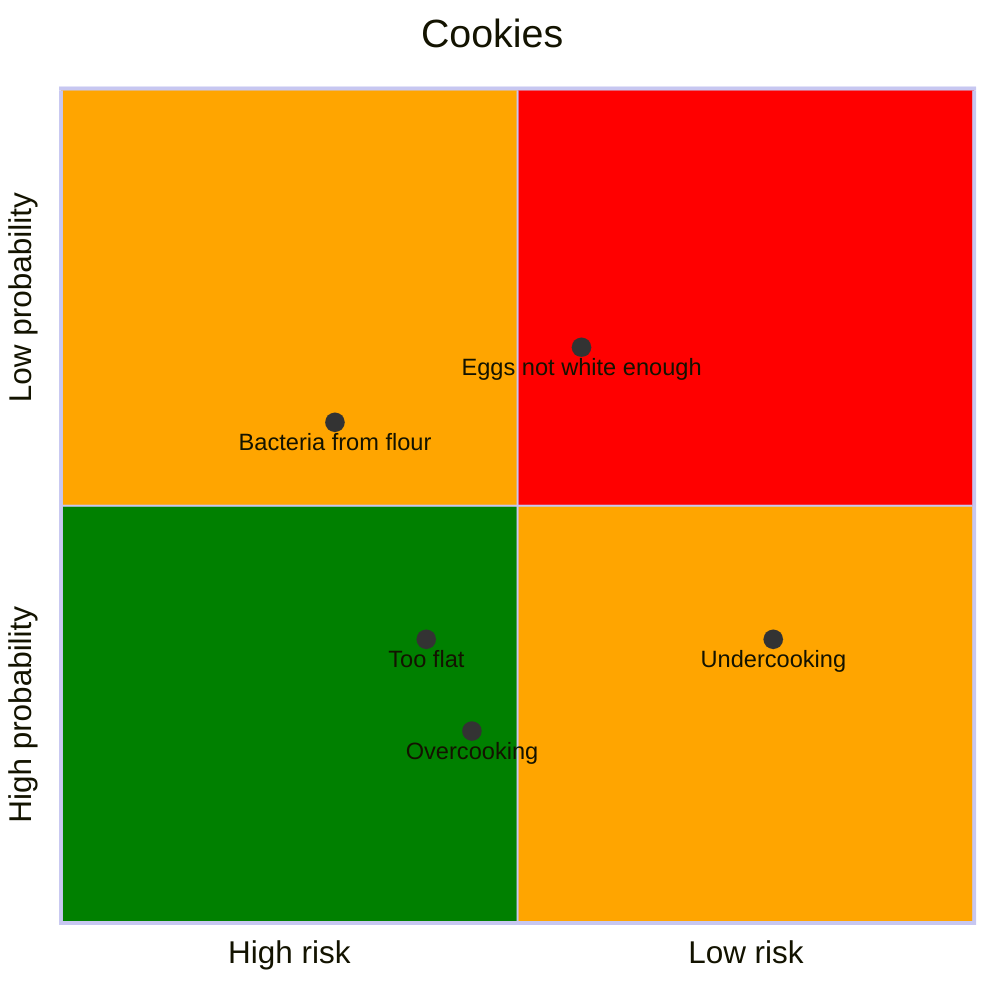

# Data_NA_project
test Anna
salut  de andalouse 
test ornella
bjr


flowchart TD
    A[Christmas] -->|Get money| B(Go shopping)
    B --> C{Let me think}
    C -->|One| D[Laptop]
    C -->|Two| E[iPhone]
    C -->|Three| F[fa:fa-car Car]
 
  ```mermaid
mindmap
  root)Fabrication de cookies(
    Assemblage
        Faire le beurre noisette *10min*
        Peser la farine *3min*
        Blanchir les oeufs *10min*
        Faire fondre le chocolat avec le beurre*10min*
        Tailler le chocolat en pépite *5m*

        🍪 Assemblage finale *30min*
    ❄️Mettre au frais *3h*
    Cuisson
        🌡️ Four à température *15min*
        ✂️ Découper en tronçon *4min*
        ♨️ Cuisson *3x10min*
  
    section Cuisson
    🌡️ Four à température :15m
    ✂️ Découper en tronçon :4m
    ♨️ Cuisson :30m
    Caca Prout
        Pipi
        Caca
```

```mermaid
gantt
    dateFormat HH:mm
    axisFormat %H:%M
    Initial milestone : milestone, m1, 17:49, 2m
    title Cookie classique


    section Assemblage
    🧈Beurre noisette :done, 25m
    ☕ Faire fondre le chocolat :done, 15m
    🍫 Tailler le chocolat en pépite :done, 10m
    Peser la farine :done, 10m
    Blanchir les oeufs :done, 10m
    Assemblage finale :done, 30m


    section mettre au frais
    ❄️Mettre au frais :active, 3h


    section Cuisson
    🌡️ Four à température :15m
    ✂️ Découper en tronçon :4m
    ♨️ Cuisson :30m
```






